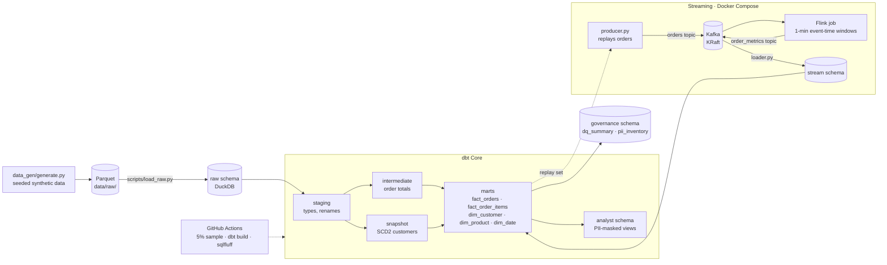
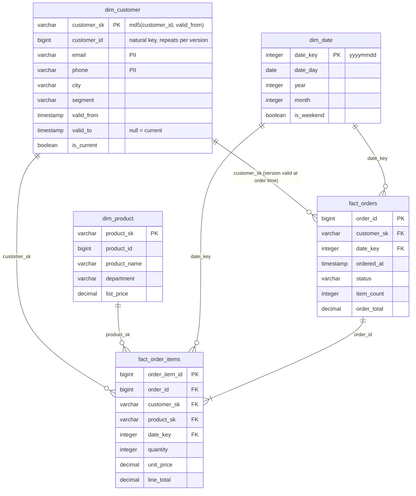
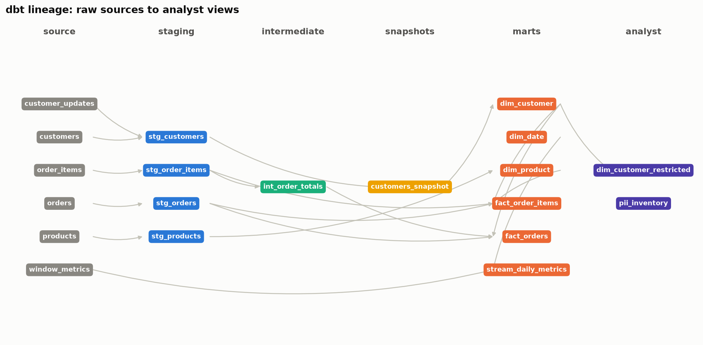

# Retail Analytics Warehouse

**A dimensional warehouse for e-commerce orders with dbt, governance built in, and a Kafka → Flink
streaming path next to the batch one. Everything runs locally on DuckDB; every number below comes
from a real run on this repo.**

By **Simran Kharbanda**


| | |
|---|---|
| **Problem** | Order data lands as raw files with PII in it. Analysts need trustworthy, fast, history-aware tables they can query without seeing personal data, and the business wants live order metrics as well as daily ones. |
| **What this is** | A star schema (2 facts, 3 dims, SCD Type 2 customer history) built by dbt from a raw layer, with contracts, tests, PII masking, role-based views, freshness checks and a data-quality log. Beside it, a Flink job computes one-minute order metrics from a Kafka stream and lands them in the same warehouse. |
| **Stack** | Python 3.11 · DuckDB · **BigQuery** · dbt Core 1.12 (dbt-duckdb, dbt-bigquery) · sqlfluff · Apache Kafka 3.9 (KRaft) · Apache Flink 1.20 / PyFlink (Table API) · Docker Compose · GitHub Actions |
| **Measured** | 1,188,451 order lines and 330,014 orders modelled; `dbt build` (14 models + snapshot + 84 tests) in **3.3–4.7 s** on a laptop (2.5 s incremental), 84/84 tests passing; streaming: **2,000 events/s** sustained with Flink keeping up (18,600 events/s into Kafka in a burst), window results in the warehouse a **median 2.27 s** after each one-minute window closes. |
| **Local vs cloud** | The same dbt project builds on **two targets**: DuckDB locally (default, CI) and **BigQuery** (`--target bigquery`). Both were run: 98/98 on each, identical row counts; the BigQuery build took 31 s and billed 1.29 GiB ($0.008). Streaming runs locally in Docker. |

> **The data is synthetic**, generated by `data_gen/generate.py` with a fixed seed. The first choice,
> the Instacart dataset, needs a Kaggle login and has no prices, no timestamps and no customer
> attributes, so it cannot support revenue metrics, event-time streaming or SCD2 history. The generator
> produces 50,000 customers with realistic PII (Faker), 5,000 products in 21 departments, and a year of
> orders with weekday and hour-of-day seasonality and heavy-tailed customer and product popularity.
> Re-running it gives byte-identical files.

## Architecture



## The warehouse

### Star schema



- **Grain.** `fact_order_items` is one row per product line; `fact_orders` one row per order, with
  totals summed from the lines in `int_order_totals` so the two can never disagree (a test checks it).
- **SCD Type 2.** `dim_customer` comes from a dbt snapshot (`timestamp` strategy on `updated_at`).
  The build runs the snapshot twice: on the initial customer file, then after a batch of 3,911
  updates (moves and segment changes). Facts join on `customer_id` *and* the validity range, so an
  order placed before a customer moved keeps pointing at the old address: 11,600 orders sit on
  second versions. `assert_scd2_versions_do_not_overlap` checks the timelines are clean.
- **Incremental.** Both facts are incremental (`delete+insert` on their key, filtered by `ordered_at`);
  `make build` does a full refresh, `make build-incremental` processes only new orders.
- **Macros.** `money()` (round to cents as `decimal(12,2)`), `surrogate_key()`, `mask_email()`,
  `mask_phone()`, `hash_pii()`, and a `generate_schema_name` override so schemas are named
  `staging`, `marts`, `analyst` rather than prefixed.

### Lineage



`make docs` generates the dbt docs site (every model and column has a description) and this image
from `manifest.json`.

## Governance

| Control | How | Where |
|---|---|---|
| **Schema tests** | `unique`, `not_null`, `accepted_values`, and `relationships` from every fact foreign key to its dimension | `models/*/schema.yml` |
| **Singular tests** | no negative quantities or prices; `fact_orders.order_total` reconciles with the sum of its lines to the cent; SCD2 versions do not overlap; analyst views expose no raw PII | `dbt/tests/` |
| **Model contracts** | `contract: enforced: true` on every mart with explicit data types; a column type drift fails the build | `models/marts/schema.yml` |
| **PII tagging** | `meta: {pii: true}` on name, email, phone and address columns; `pii_inventory` is generated from the dbt graph at build time, so it cannot drift from the YAML | `analyst.pii_inventory` |
| **PII masking** | `dim_customer_restricted`: names dropped, email → `j***@domain`, phone → `+1-990-***-****`, plus an md5 `email_hash` so distinct people can still be counted | `analyst` schema |
| **Roles** | DuckDB has no roles, so access is by schema: the **analyst** role gets the `analyst` schema (masked views) and the facts; the **engineer** role gets `marts` and `raw`. On BigQuery the same split is authorized views plus column-level security (policy tags on the PII columns), see below. | this README |
| **Freshness** | `dbt source freshness` on every raw table via `_loaded_at` (warn after 24 h, error after 72 h) and on the stream table | `sources.yml` |
| **Quality log** | after every build `scripts/dq_summary.py` appends tests run / passed / failed and build time to `governance.dq_summary`, and each failing test to `governance.dq_failures` | `results/last_build.json` |

**On BigQuery** the same split is enforced by the platform: `analyst.dim_customer_restricted` is
registered as an [authorized view](https://cloud.google.com/bigquery/docs/authorized-views) on the
`marts` dataset (`scripts/bq_authorized_view.py`, part of `make bq-build`), so a principal granted
the `analyst` dataset can query the masked view while having no access to `marts.dim_customer` at
all. The remaining step for a real deployment is a policy tag on the PII columns (Data Catalog
taxonomy → fine-grained reader role), which needs an organisation-level taxonomy that a personal
project does not have.

## Streaming

`streaming/` is a self-contained Docker Compose stack: Kafka 3.9 in KRaft mode (no ZooKeeper) and a
Flink 1.20 JobManager + TaskManager built from an image that adds Python and PyFlink.

1. **`producer.py`** replays orders from the warehouse (exported to Parquet first) into the `orders`
   topic as JSON at a target rate, stamping each event's `event_time`.
2. **`jobs/order_metrics.py`** (PyFlink Table API) reads the topic with a 2-second watermark and
   computes **orders per minute, revenue per minute and average basket size** over one-minute
   tumbling event-time windows, writing each closed window to the `order_metrics` topic with the
   time it was emitted.
3. **`loader.py`** consumes the results into `stream.window_metrics` in DuckDB, recording the load
   time, so `latency_ms = loaded_at − window_end` is the true end-to-end delay from a window
   closing to its numbers being queryable.
4. **`stream_daily_metrics`** (dbt) joins the windows to `dim_date`.

### Measured

Two runs, both replaying all 330,014 orders through Kafka → Flink → DuckDB on the same laptop
(Flink: 1 TaskManager, 2 parallel source subtasks; `results/streaming_run_*.json`).

| Run | Producer → Kafka | Flink source rate | Complete windows | Orders per window | Emitted after window close | In DuckDB after window close |
|---|---|---|---|---|---|---|
| **Paced** (target 2,000/s, 165 s) | **1,999.9 events/s** | 2,000/s (1,997–2,001 sampled every 5 s; keeps up) | 3 | 69,219 · 80,216 · 70,787 | 2.17 / 2.24 / 4.64 s | **median 2.27 s** (min 2.17, max 4.64) |
| **Burst** (unthrottled, 17.7 s) | **18,606 events/s** | 5,501/s peak on Flink's 60-second meter; the backlog drained ~27 s after the producer stopped, about 7,000 events/s sustained | 1 | 220,222 | 7.04 s | 7.06 s |

Reading the numbers: at 2,000 events/s the pipeline is watermark-bound, so results land 2.2 s after
each minute closes (2 s of that is the allowed out-of-orderness; the last window's 4.6 s is the
trailer phase, where the watermark only advances once a second). In the burst, Kafka absorbs
18.6k events/s but the 2-slot Flink job processes about 7k/s, so the window is emitted once the
backlog clears, 7 s after it closed. Scaling Flink's parallelism is the obvious next step; the job
is stateless apart from the window aggregates, so it is a config change.

Throughput is the producer's achieved rate into Kafka with Flink keeping up (its source ingest rate
was sampled from the REST API every 5 s during the run). Latency has a floor of 2 s from the
watermark allowance; the rest is Flink's window trigger, Kafka and the loader. The last partial
window of a run never closes, because event-time windows need a later event to advance the
watermark; that is expected and the runs are sized for several complete windows.

## Results (batch)

Full dataset, MacBook Pro (Intel i7-9750H, 16 GB), DuckDB file on local SSD.

| Table | Rows |
|---|---|
| raw.order_items | 1,188,451 |
| raw.orders | 330,014 |
| raw.customers / customer_updates | 50,000 / 3,911 |
| raw.products | 5,000 |
| marts.fact_order_items | 1,188,451 |
| marts.fact_orders | 330,014 |
| marts.dim_customer (SCD2 versions) | 53,911 (50,000 customers, 3,911 with two versions) |
| marts.dim_product | 5,000 |
| marts.dim_date | 1,096 |
| analyst.dim_customer_restricted | 53,911 |
| analyst.pii_inventory | 10 columns |

| Measure | Value |
|---|---|
| Data generation (`make data`) | 20 s |
| Raw load (`scripts/load_raw.py`) | 1.2 s |
| `dbt build --full-refresh`: 14 models, 1 snapshot, 84 tests | **3.3–4.7 s** across runs (incremental rebuild: 2.5 s) |
| Tests | **84 / 84 passed (100%)** |
| Source freshness | 5 raw tables pass; `stream.window_metrics` warns until the stream has run |
| sqlfluff | 0 violations |

### The same project on BigQuery

`make bq-load BQ_PROJECT=<id>` loads the Parquet files with load jobs (free), and
`make bq-build BQ_PROJECT=<id>` runs the identical two-pass snapshot and `dbt build` against
BigQuery (US multi-region). Measured on 2026-09-27 (`results/bigquery_build.json`):

| Measure | DuckDB (laptop) | BigQuery |
|---|---|---|
| Models + snapshot + tests | 14 + 1 + 84 | 14 + 1 + 84 |
| Result | 98 / 98 pass | **98 / 98 pass** |
| Row counts (dim_customer / fact_orders / fact_order_items) | 53,911 / 330,014 / 1,188,451 | 53,911 / 330,014 / 1,188,451 |
| Build time | 3.3–4.7 s | 31 s (111 jobs, 82 slot-seconds) |
| Data scanned | – | 0.72 GB processed, **1.29 GiB billed** (10 MB minimum per query) |
| Cost at on-demand list price | – | **$0.008** (inside the free 1 TiB/month) |
| Layers | schemas | one dataset each: raw, staging, intermediate, snapshots, marts, analyst, stream |

Making one SQL codebase run on both engines came down to a handful of dispatched macros
(`dbt/macros/cross_db.sql`): `date_key`, `date_name`, `date_part`, `day_spine`, `md5_hex` (BigQuery's
MD5 returns bytes), `email_domain`, and `incremental_strategy` (`delete+insert` on DuckDB, `merge` on
BigQuery). Two engine differences bit during the port and are worth knowing: BigQuery rejects
parameterised types in `CAST` (`numeric(12,2)`), so money columns are plain `numeric` on both, and
BigQuery has no `VALUES` clause in `FROM`, so the generated PII inventory is a `UNION ALL` of literals.
Model contracts use type names both engines accept (`int64`, `string`, `bool`, `numeric`, `timestamp`,
`date`) and are enforced on both. CI runs DuckDB only, so no cloud credentials live in GitHub.

## Running it

```bash
make setup           # two virtualenvs (dbt stack; PyFlink), via uv
make build           # data -> raw -> snapshot x2 -> dbt build -> DQ summary   (29 s end to end)
make bq-load BQ_PROJECT=<gcp-project>    # same raw files into BigQuery (needs gcloud auth application-default login)
make bq-build BQ_PROJECT=<gcp-project>   # same build on BigQuery -> results/bigquery_build.json
make docs            # dbt docs + docs/lineage.png
make lint            # sqlfluff
make stream-up       # Kafka + Flink (Docker)
make stream          # replay, window, load, measure -> results/streaming_run.json
make stream-down
make all             # build + docs
```

CI (`.github/workflows/ci.yml`) generates a 5% sample, runs the same snapshot sequence and
`dbt build`, writes the DQ summary and lints, on every push.

## Project layout

```
data_gen/generate.py        seeded synthetic dataset -> data/raw/*.parquet
scripts/load_raw.py         Parquet -> raw schema (+ empty stream table)
scripts/dq_summary.py       run_results.json -> governance.dq_summary / dq_failures
scripts/lineage.py          manifest.json -> docs/lineage.png
scripts/load_raw_bigquery.py, bq_build_summary.py, bq_authorized_view.py   the BigQuery target
dbt/                        models/{staging,intermediate,marts,governance,streaming}, snapshots/, macros/, tests/
streaming/                  docker-compose.yml, flink.Dockerfile, jobs/order_metrics.py,
                            producer.py, loader.py, export_replay.py, run_experiment.py
results/                    last_build.json, streaming_run.json (the numbers in this README)
```

## Author

**Simran Kharbanda**
